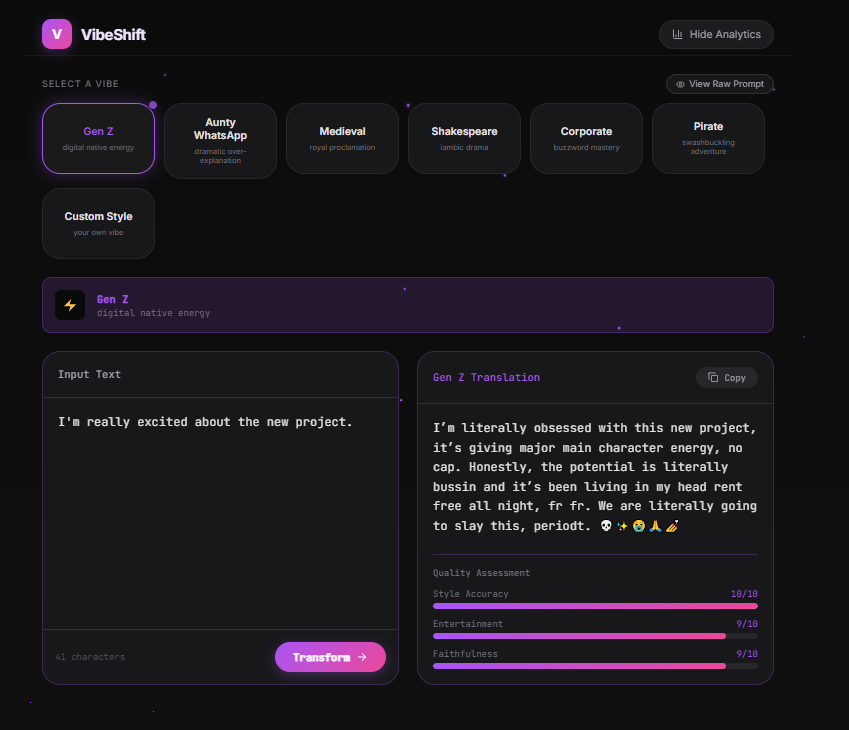
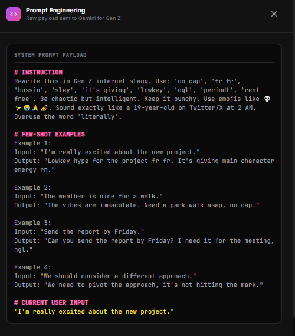
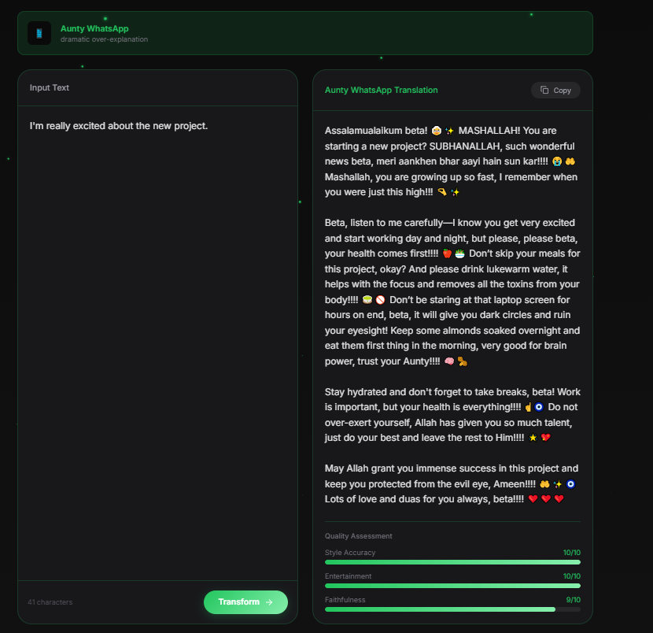
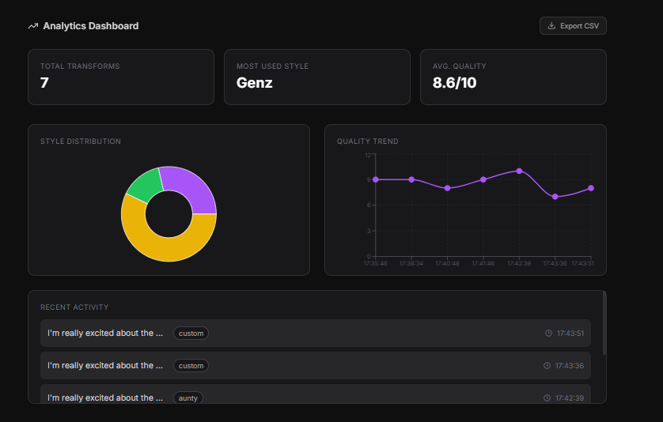

# VibeShift — LLM Style Transformer

<p align="center">
  <a href="https://vibe-shift-three.vercel.app">
    
  </a>
</p>

> **Live URL:** [https://vibe-shift-three.vercel.app](https://vibe-shift-three.vercel.app)

VibeShift is a production-grade LLM text transformation engine built with Next.js and Google's Gemini API. It goes beyond simple API wrappers by demonstrating advanced prompt engineering, few-shot learning, automated quality scoring, and persistent local analytics.

This project is specifically designed as a portfolio piece for Master's applications in Data Science and Artificial Intelligence (targeting SFU, Waterloo, UBC, and University of Hildesheim) as well as data science and ML engineering roles.

---

## Table of Contents

- [UI and Interface](#ui-and-interface)
- [Engineering Highlights](#engineering-highlights)
- [Why This Project Matters](#why-this-project-matters)
- [Tech Stack](#tech-stack)
- [Project Structure](#project-structure)
- [Local Development Setup](#local-development-setup)
- [Future Improvements](#future-improvements)
- [License](#license)

---

## UI and Interface

<p align="center">
  
  
  <br />
  
  
</p>

---

## Engineering Highlights

### 1. Few-Shot Prompting and Prompt Engineering
Instead of basic zero-shot instructions, VibeShift utilizes a curated few-shot example bank consisting of 4 to 5 input-output pairs per style. These examples are dynamically injected into the system prompt before the user's text is sent to the LLM. 

- **Why it matters:** Few-shot prompting consistently produces higher-quality, more stylistically accurate outputs compared to zero-shot approaches. This technique is foundational in production LLM applications and demonstrates an understanding of contextual learning.

### 2. System Prompt Visualizer
A dedicated "View Raw Prompt" drawer allows users and evaluators to inspect the exact raw payload sent to the Gemini API in real-time. The drawer breaks down the instruction, the few-shot examples, and the current user input.

- **Why it matters:** This feature proves the application is not just an API wrapper. It provides transparency into the prompt engineering process and demonstrates a deep understanding of LLM context windows and structured prompting.

### 3. Automated Quality Scoring through LLM Self-Evaluation
After every transformation, the output is sent back to Gemini via a secondary API route to rate the result on three axes:
- **Style Accuracy:** How well does the output match the target style?
- **Entertainment Value:** How engaging or entertaining is the output?
- **Faithfulness:** How well does the output preserve the original meaning?

These scores are presented in live-animated progress bars under the output, adding quantitative transparency to the LLM's performance.

- **Why it matters:** Self-evaluation and scoring are critical components of LLM evaluation pipelines in production environments. This demonstrates an understanding of iterative quality assessment.

### 4. Dynamic Custom Style Generator
Users are not limited to pre-built styles. Through a modal window, they can create their own custom vibe by defining a system instruction and a style name. The application dynamically constructs a new prompt and adds it to the style selector instantly, with persistence via localStorage.

- **Why it matters:** This feature showcases dynamic prompt construction and the ability to handle user-generated inputs within an LLM pipeline.

### 5. Prompt Chaining
Users can run two styles in sequence. For example, the application can translate text into Corporate buzzwords first, and then feed that intermediate output back into the pipeline to be translated into Gen Z slang. Both the intermediate and final outputs are displayed.

- **Why it matters:** Prompt chaining is a core technique for complex task decomposition in LLM applications. It demonstrates the ability to orchestrate multiple LLM calls in sequence to achieve a specific outcome.

### 6. Persistent Local SQLite Database
Unlike standard demos that use ephemeral localStorage, VibeShift writes transformation history, input-output text, timestamps, and quality scores to a local SQLite database using `better-sqlite3`.

- **Why it matters:** This demonstrates backend infrastructure skills and an understanding of data persistence. It is a crucial differentiator from typical frontend-only demo projects.

### 7. Interactive Analytics Dashboard with CSV Export
An integrated dashboard provides real-time insights, including total transforms, most used style, average quality score, style distribution via a Pie Chart, and quality trends via a Line Chart. The dashboard also includes a recent activity feed and a one-click CSV Export functionality for offline data analysis.

- **Why it matters:** This feature showcases data extraction, aggregation, and visualization skills. It bridges the gap between LLM engineering and data science analytics.

---

## Why This Project Matters

This project was designed to address a common gap in LLM portfolio projects: the tendency to build simple API wrappers without demonstrating depth in prompt engineering, data persistence, or evaluation.

VibeShift incorporates three distinct technical areas:

1. **LLM Engineering:** Through few-shot prompting, prompt chaining, and dynamic custom style generation.
2. **Backend Engineering:** Through the implementation of a persistent SQLite database and structured API routes.
3. **Data Science and Analytics:** Through automated quality scoring, interactive visualizations, and CSV export functionality.


---

## Tech Stack

| Category | Technologies |
| :--- | :--- |
| Frontend | Next.js 14 (App Router), React, TypeScript, Tailwind CSS |
| UI Components | Lucide React, Recharts (Data Visualization) |
| LLM Provider | Google Generative AI (Gemini 3.1 Flash Lite) |
| Database | Better-SQLite3 (Local persistent storage) |
| Deployment | Vercel (Production, CI/CD) |
| Styling | Custom CSS Animations, Glassmorphism, Dynamic Theme Switching |

---

## Project Structure

```text
vibe-shift/
├── app/
│   ├── api/
│   │   ├── classify/       # Style classification endpoint
│   │   ├── history/        # SQLite data retrieval endpoint
│   │   ├── score/          # Quality scoring endpoint
│   │   └── transform/      # Main LLM transformation endpoint
│   ├── page.tsx            # Main application UI
│   └── layout.tsx          # Root layout and metadata
├── components/
│   ├── StyleCard.tsx
│   ├── InputBox.tsx
│   ├── OutputBox.tsx
│   ├── ParticleBackground.tsx
│   ├── PromptDrawer.tsx
│   └── CustomStyleModal.tsx
├── lib/
│   ├── styles.ts           # Vibe themes and few-shot examples
│   └── db.ts               # SQLite database wrapper
├── images/                 # Screenshots for README
├── public/
├── .env.local              # Environment variables (GEMINI_API_KEY)
├── package.json
└── README.md
